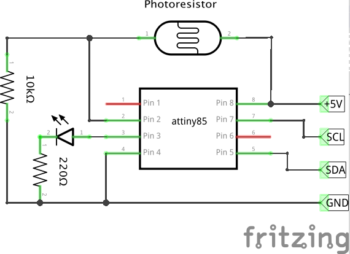

# attiny_photoresistor_i2c

Photoresistor connected by I2C using ATtiny85



This example shows how to build analog to digital converter using ATtiny85 and connect it to any device (Raspberry Pi, Arduino) using I2C bus. Here photoresistor has been used, but any analog meter will be fine: temperature, potentiometer, moisture...

#Reading data

ATtiny sends current measurement as 2 8bit value. First older bits, then younger 8 bits. 

```
Wire.requestFrom(0x13, 2);    // request 2 bytes from slave device #0x13

int i =0;
unsigned int readout = 0;

while (Wire.available()) { // slave may send less than requested
byte c = Wire.read(); // receive a byte as character

if (i == 0) {
    readout = c;
} else {
    readout = readout << 8;
    readout = readout + c;
}

i++;
}

Serial.print(readout);
```

#Notes

* # Notes

* Arduino IDE 1.6.6. Should work on older releases, but never tested
* Uses TinyWireS library. Get it using Library Manager of (GitHub directly)[https://github.com/rambo/TinyWire/tree/master/TinyWireS]
* ATtiny45/85 board definitions. Tested with [damellis/attiny](https://github.com/damellis/attiny)
* Uses 1MHz internal osciallator 
